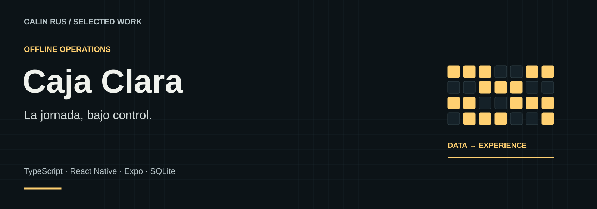

# Caja Clara

**La jornada, bajo control.**

Una herramienta personal para organizar ventas, inventario, calendario e informes de una jornada de trabajo desde el móvil.

**Stack:** TypeScript · React Native · Expo · SQLite  
**Estado:** Aplicación Android · 1.7

[Portfolio](https://github.com/calinrus-dev/portfolio) · [Experiencia](docs/EXPERIENCIA.md) · [Componentes](docs/COMPONENTES.md) · [Diseño técnico](docs/ARQUITECTURA.md) · [Demostraciones](docs/DEMOSTRACIONES.md) · [Estado](docs/ESTADO.md)

## El problema que aborda

Registrar una venta es solo una parte de la jornada: también hay recepciones, devoluciones, cambios de fecha y cierres. Caja Clara agrupa esas tareas en una experiencia orientada al uso diario.

## Qué compone la experiencia

- **Terminal.** Entrada de importes y registro de operaciones con controles grandes.
- **Inventario.** Recepciones, libros, búsqueda y seguimiento de existencias.
- **Calendario.** Consulta diaria y mensual de ventas, liquidaciones y planificación.
- **Informes.** Desgloses y documentos para revisar la actividad guardada.

*Lámina explicativa con datos ficticios. Su contenido también está disponible como texto en [Componentes](docs/COMPONENTES.md).*

## Decisiones que definen el proyecto

- **Claridad en momentos rápidos.** Teclado, confirmaciones y áreas táctiles reducen la ambigüedad al introducir importes.
- **Correcciones comprensibles.** Una corrección conserva la relación con la actividad anterior para poder revisar qué ocurrió.
- **Datos en el dispositivo.** La herramienta se centra en la jornada personal y el trabajo local.

## Explorar el caso

- [Experiencia y recorrido](docs/EXPERIENCIA.md): intención, interacción y criterios de revisión.
- [Componentes](docs/COMPONENTES.md): las piezas visibles y el papel de cada una.
- [Diseño técnico](docs/ARQUITECTURA.md): responsabilidades y compromisos de diseño.
- [Demostraciones](docs/DEMOSTRACIONES.md): qué enseñan las imágenes y cómo leer la evidencia.
- [Estado y siguientes pasos](docs/ESTADO.md): alcance actual, comprobaciones y trabajo pendiente.

## Sobre este repositorio

Caso de estudio público de un proyecto con implementación privada. Reúne documentación, diagramas e imágenes seleccionadas. El motor, las integraciones y los datos operativos se mantienen privados. Las piezas públicas seleccionadas indican su origen y alcance.

Revisión editorial: 28 de septiembre de 2026. Autor: [Calin Rus](https://github.com/calinrus-dev).

[Instagram @c4linrus](https://www.instagram.com/c4linrus/) · [LinkedIn / calinrus](https://www.linkedin.com/in/calinrus-dev/) · [Todos los proyectos](https://github.com/calinrus-dev/portfolio)
