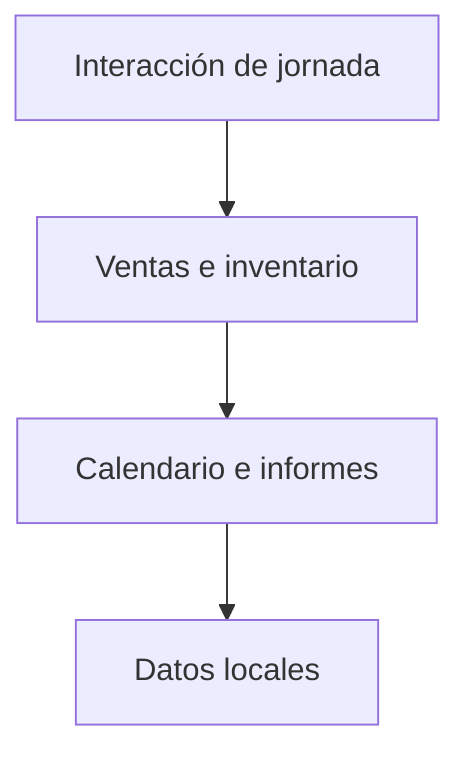

# Caja Clara / Diseño técnico

[← Inicio](../README.md)

## Contexto

Una herramienta personal para organizar ventas, inventario, calendario e informes de una jornada de trabajo desde el móvil.

**Tecnologías asociadas al proyecto:** TypeScript · React Native · Expo · SQLite.

## Mapa de responsabilidades

Este mapa conceptual organiza la explicación del producto; no representa endpoints, procesos desplegados ni contratos internos.

## Claridad en momentos rápidos

Teclado, confirmaciones y áreas táctiles reducen la ambigüedad al introducir importes.

## Correcciones comprensibles

Una corrección conserva la relación con la actividad anterior para poder revisar qué ocurrió.

## Datos en el dispositivo

La herramienta se centra en la jornada personal y el trabajo local.

## Rendimiento y dependencia

Mi criterio de trabajo es medir antes de optimizar: identificar el recorrido relevante, observar tiempo de respuesta y uso de recursos y comparar cambios con la misma carga. En sistemas nativos también me interesa la disposición de datos, la localidad de memoria y el trabajo repetido.

Local-first es una preferencia arquitectónica: conservar una experiencia útil y control sobre los datos en el dispositivo, e incorporar servicios externos cuando aporten una función concreta. Su alcance varía por proyecto; no implica que todas las integraciones de este caso funcionen sin conexión.

No se publican cifras de rendimiento sin un ensayo identificado. La evidencia específica disponible está en [Estado](ESTADO.md).

## Qué conviene demostrar después

- Ampliar validación de accesibilidad en dispositivos.
- Pulir los recorridos de corrección y consulta histórica.
- Mejorar la legibilidad de informes y recordatorios.
