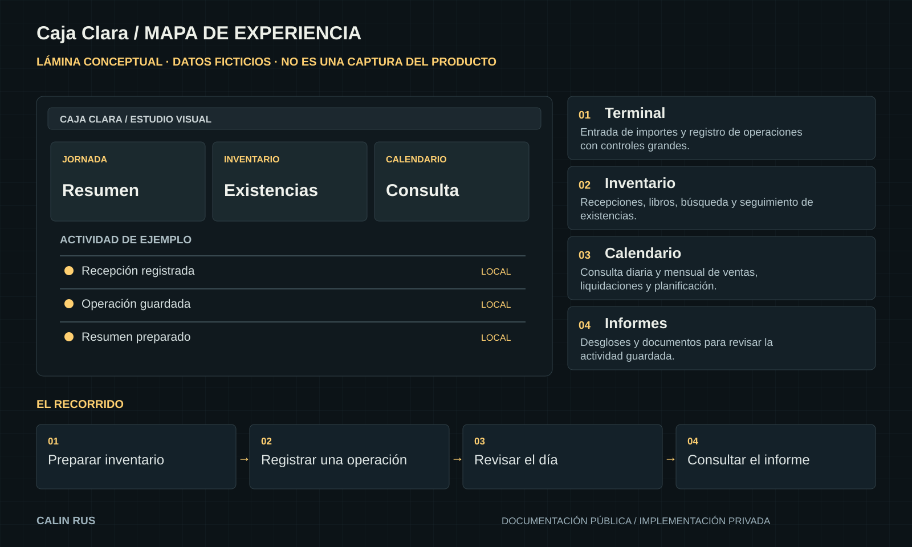

# Caja Clara / Demostraciones

[← Inicio](../README.md)

## Qué enseña esta publicación

Ejemplo editorial con datos ficticios: recibir existencias, registrar una venta y observar el cambio en el resumen.

No se publican capturas de caja real, datos de clientes, registros de vendedor ni bases de datos.

## Guion del caso de estudio

Este guion sirve para explicar el recorrido documentado y preparar una demostración controlada. No afirma que se haya ejecutado completo durante esta publicación.

1. **Preparar inventario.** Observar: Entrada de importes y registro de operaciones con controles grandes.
2. **Registrar una operación.** Observar: Recepciones, libros, búsqueda y seguimiento de existencias.
3. **Revisar el día.** Observar: Consulta diaria y mensual de ventas, liquidaciones y planificación.
4. **Consultar el informe.** Observar: Desgloses y documentos para revisar la actividad guardada.

## Lectura de la lámina

La ilustración reúne las piezas y sus relaciones. Sus estados, textos de muestra y formas son editoriales. Las capturas reales, cuando existen, aparecen identificadas por separado.

## Evidencia disponible

Las notas de la versión 1.7 documentan 448 pruebas en 52 suites, compilación Android y recorridos en un emulador aislado. Son resultados históricos de esa entrega; no se han repetido durante la creación de este escaparate.

[Alcance y próximos pasos](ESTADO.md)
